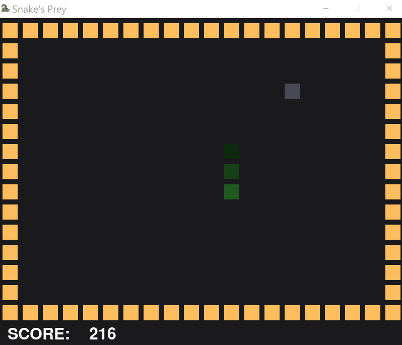

# snakes-prey

🐁💨💨💨🐍

You are a small, innocent mouse, living in a cruel world where you're being chased by an evil, ever-growing snake.

Use Arrow keys to control the mouse, and don't get caught!

Inspired by [CS Dojo](https://www.youtube.com/channel/UCxX9wt5FWQUAAz4UrysqK9A)'s video [Making a Snake Game Where You're the Food in Python](https://www.youtube.com/watch?v=zH3zyZ4q0oU).

Snake icon made by [Freepik](https://www.freepik.com) from [Flaticon](https://www.flaticon.com/).

## API

_snake.py_ file contains the following classes:

- **SnakeGame(height: int, width: int)** - represents the game, takes the dimension of the board as arguments; attributes and methods:
  - **board: numpy.ndarray** - a 2-dimensional _numpy_ array representing the game board, filled with values from the _Tiles_ enum
  - **get_snake_head() -> Coord** - returns a Coord object corresponding to the head of the snake
  - **enlarge_snake()** - adds 1 tile to the end of the snake
  - **move_prey(direction: Direction) -> bool** - moves the prey in the given direction, returns True if that move resulted in game over (False otherwise)
  - **move_snake() -> bool** - moves the snake 1 tile towards the prey, using A\*, returns True if that move resulted in game over (False otherwise)
- **Coord(x: int, y: int)** - represents a point on the board, takes _x_ and _y_ coordinates as arguments; operations and methods:
  - **==, !=, >, >=, <, <=** - compare _x_ coordinate to _x_ coordinate and _y_ coordinate to _y_ coordiante
  - **-** - negates _x_ coordinate and _y_ coordinate
  - **distance(other : Coord)** - calculates the Euclidean distance between two points
- **Direction** - enum with the values **UP, DOWN, LEFT, RIGHT**
- **Tiles** - enum with the values **EMPTY, BORDER, SNAKE, PREY**
